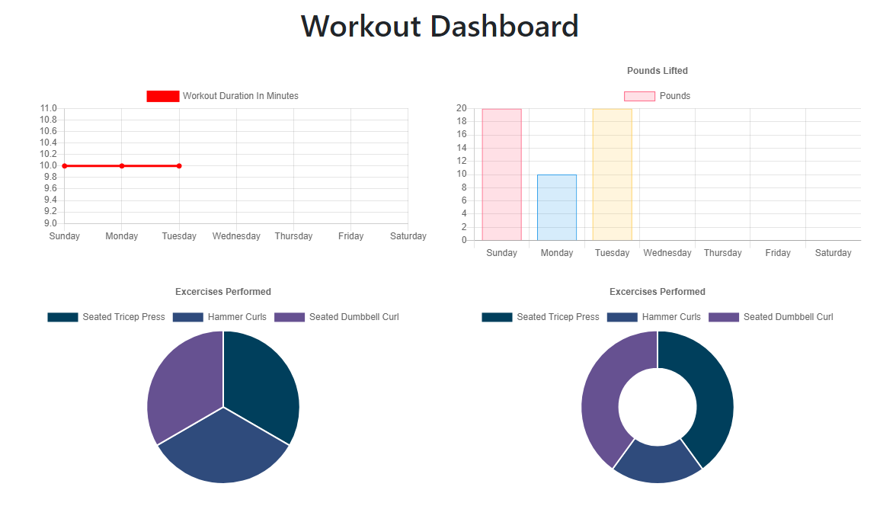

# Workout Tracker

## Table of Contents
- [Description](#description)
- [Usage](#usage)
- [Database](#database)


## Description
This application is for tracking and storing workout information. You can add resistance and cardio workouts as you do them and the dashboard displays data for different workout sessions.

## Usage
Upon opening the website you are shown your most recent workout stats along with the option to add or continue a workout. When adding an excercise you choose the type of workout and fill in the stats. Clicking the link in the top left of the page will take you to the workout dashboard which displays information for the last weeks of workouts. 




## Database
This application uses a MongoDB database using Mongoose. Below is a snippet of the schema used for this database.

```
const workoutSchema = new Schema({
    day: {
        type: Date,
        default: Date.now,
    },

    totalDuration: {
        type: Number
    },

    exercises: [
        {
            type: {
                type: String,
                trim: true
            },
            name: {
                type: String,
                trim: true
            },
            duration: {
                type: Number
            },
            weight: {
                type: Number
            },
            reps: {
                type: Number
            },
            sets: {
                type: Number
            }
        }  
    ]
});
```